# Infrastructure Knowledge Roadmap

A step-by-step learning path to understand how a web application moves from code on a laptop to a real production system used by users.

---

## Table of Contents

| Part | Focus | Sections |
|------|-------|----------|
| **I** | Application fundamentals | 1–9 |
| **II** | Deployment & server | 10–16 |
| **III** | Cloud & operations | 17–24 |
| **IV** | Scale & production | 25–28 |

---

## Roadmap at a Glance

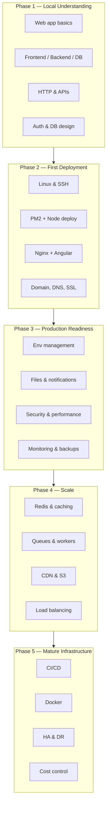

---

# Part I — Application Fundamentals

---

## 1. Web Application Basics

A web application is usually made of:

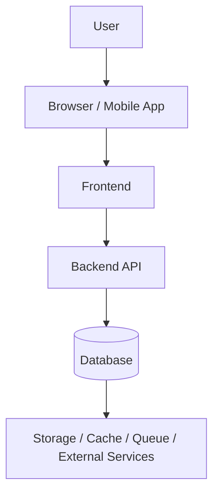

**ClassInTown example:**

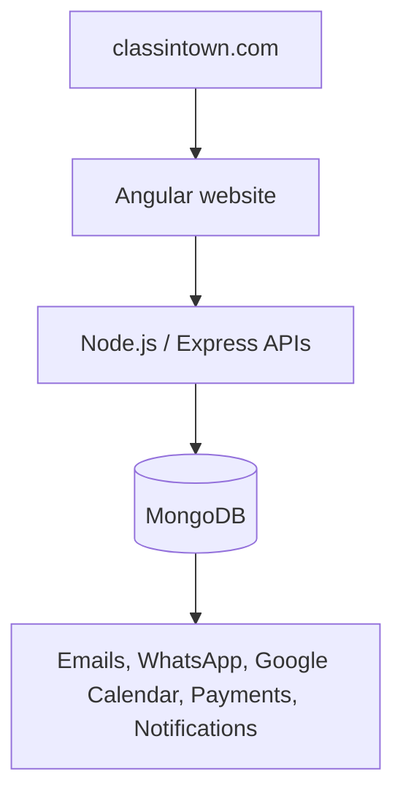

**You should understand:**

- What happens when a user opens a website?
- What is a browser request?
- What are HTML, CSS, and JavaScript?
- What is an API?
- What is a server?
- What is a database?

---

## 2. Frontend, Backend, Database

This is the core foundation.

| Layer | Role |
|-------|------|
| **Frontend** | What the user sees |
| **Backend** | Business logic |
| **Database** | Permanent data storage |

**Example breakdown:**

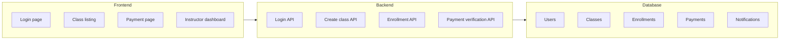

**MEAN stack mapping:**

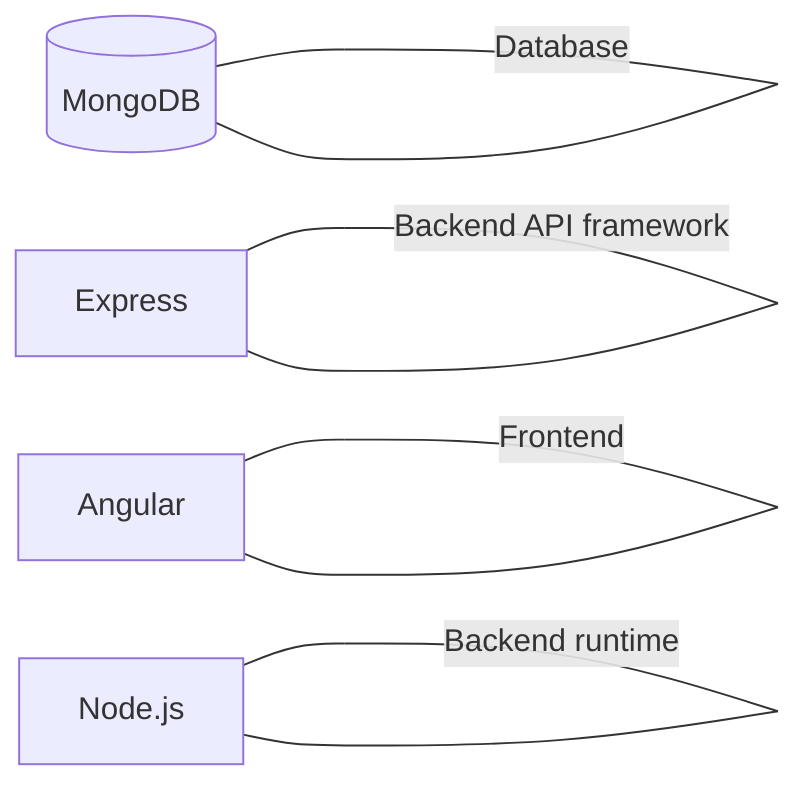

---

## 3. Request–Response Flow

You must understand how one user action works end to end.

**Example: user logs in**

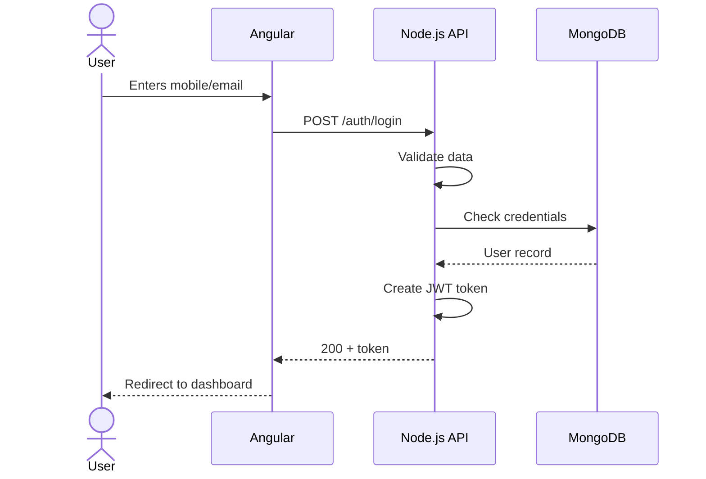

**Important topics:**

- HTTP, HTTPS
- GET, POST, PUT, PATCH, DELETE
- Status codes, headers
- Request body, response body
- Cookies, tokens

---

## 4. APIs

APIs connect the frontend and backend.

**Example API routes:**

| Method | Route |
|--------|-------|
| POST | `/api/v1/auth/login` |
| GET | `/api/v1/classes` |
| POST | `/api/v1/enrollments` |
| PATCH | `/api/v1/payments/:id` |

**You should learn:**

- REST APIs, API versioning
- Request validation, response structure, error handling
- Authentication & authorization middleware
- Rate limiting

**Good API response format:**

```json
{
  "success": true,
  "message": "Login successful",
  "data": {}
}
```

**Good error response format:**

```json
{
  "success": false,
  "errorType": "VALIDATION_ERROR",
  "message": "Mobile number is required"
}
```

---

## 5. Authentication and Authorization

| Concept | Question |
|---------|----------|
| **Authentication** | Who are you? |
| **Authorization** | What are you allowed to do? |

**Role example:**

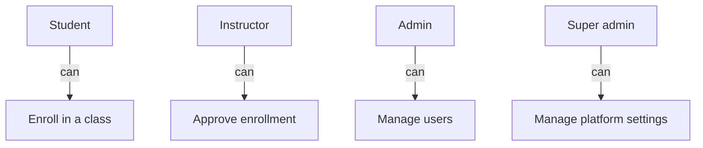

**Learn:**

- JWT token, refresh token, session
- Password hashing, OTP login, Google login
- Role-based access control (RBAC)
- Permission-based access control

---

## 6. Database Design

This is extremely important.

**For MongoDB, learn:**

- Collections, documents, references, embedded documents
- Indexes, aggregation, transactions, schema design

**Example collections:**

```mermaid
erDiagram
    User ||--o{ Enrollment : makes
    Class ||--o{ Enrollment : has
    Class ||--o{ Schedule : has
    User ||--o{ Payment : makes
    PaymentPlan ||--o{ Payment : defines
    User ||--o{ Notification : receives
    User ||--o{ ChatMessage : sends
```

**You must understand:**

- When to embed vs. reference data
- How to avoid duplicate data
- How to design indexes
- Soft delete, `createdAt`, `updatedAt`

---

## 7. File Storage

Most real applications need file uploads.

**Examples:** profile image, class image, payment proof, QR code, documents, certificates

**Learn:** Multer, local storage, public/private folders, S3, CloudFront/CDN, file size limits, type validation, signed URLs

**Basic flow:**

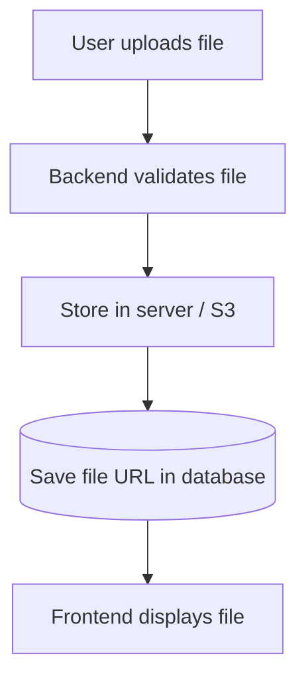

---

## 8. Emails, SMS, WhatsApp, Push Notifications

Real applications communicate with users.

**Learn:**

- Email, SMS, WhatsApp Business API
- Web push, Firebase FCM, in-app notifications, socket notifications

**Example: student enrolls**

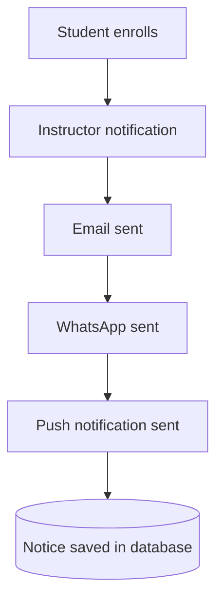

---

## 9. Real-Time Communication

Used for chat, live notifications, and dashboards.

**Learn:** WebSocket, Socket.IO, rooms, events, online users, unread count, real-time updates

**Example: chat message**

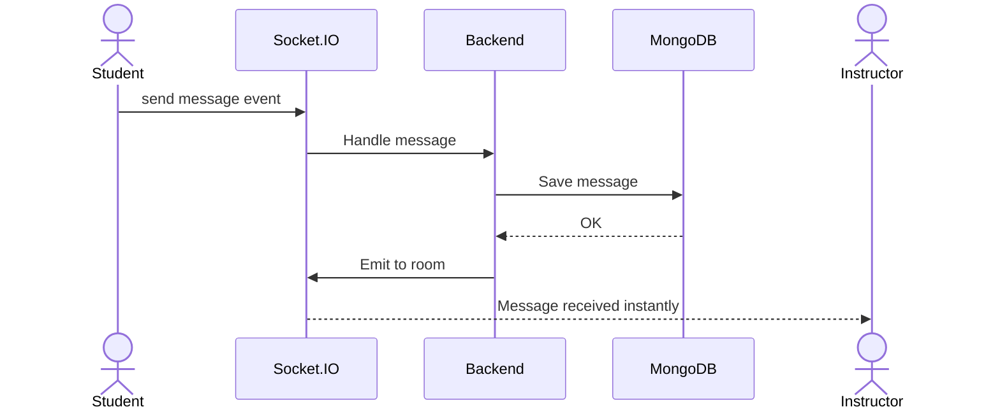

---

# Part II — Deployment & Server

---

## 10. Server Basics

Move from code to infrastructure.

**Learn:**

- What is a server, Linux, Ubuntu?
- SSH, processes, ports, firewalls

**Basic server flow:**

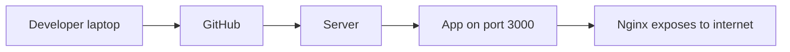

**Commands to know:**

```bash
ssh user@server-ip
ls, cd, mkdir, nano, cat, tail
ps, kill, sudo, chmod, chown
```

---

## 11. Node.js App Deployment

**Learn:** `npm install`, environment variables, `.env`, PM2, logs, restart, reload, build

**Typical backend deployment:**

```bash
git pull
npm install
npm run build
pm2 restart app
pm2 logs
```

**PM2 concepts:** process manager, auto restart, logs, startup script, cluster mode, environment config

---

## 12. Frontend Deployment

**Angular deployment flow:**

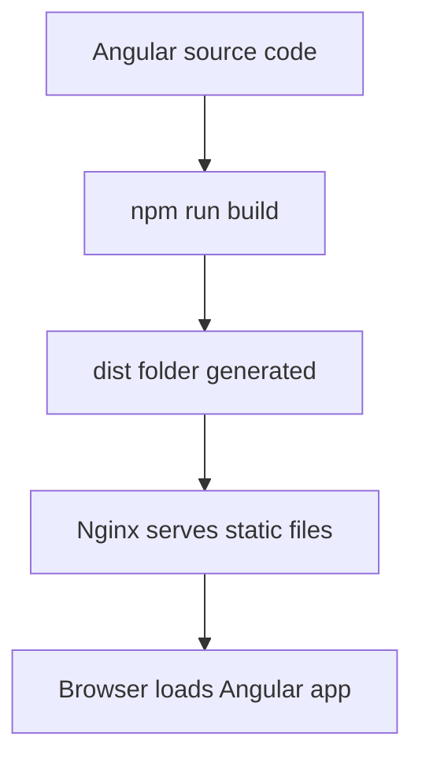

**Learn:**

- Angular build, environment files, API base URL
- Static hosting, browser caching, service worker
- SPA routing fallback — all frontend routes should fallback to `index.html`

---

## 13. Nginx and Reverse Proxy

Nginx is a very important infrastructure component.

**It can:**

- Serve frontend, forward API requests to Node.js
- Handle HTTPS, redirects, compression, upload limits
- Route WebSocket traffic

**Typical flow:**

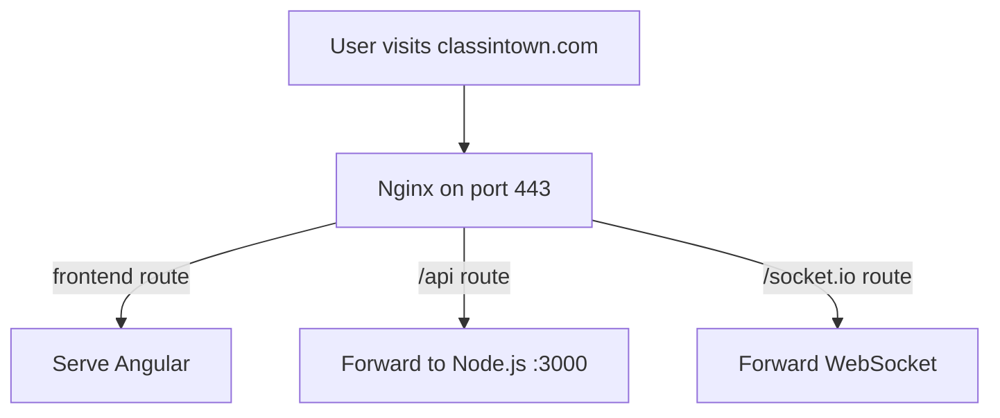

---

## 14. Domain, DNS, SSL

This is where your app becomes public.

**Learn:** domain name, DNS, A record, CNAME, nameserver, SSL, HTTPS, Let's Encrypt, Certbot

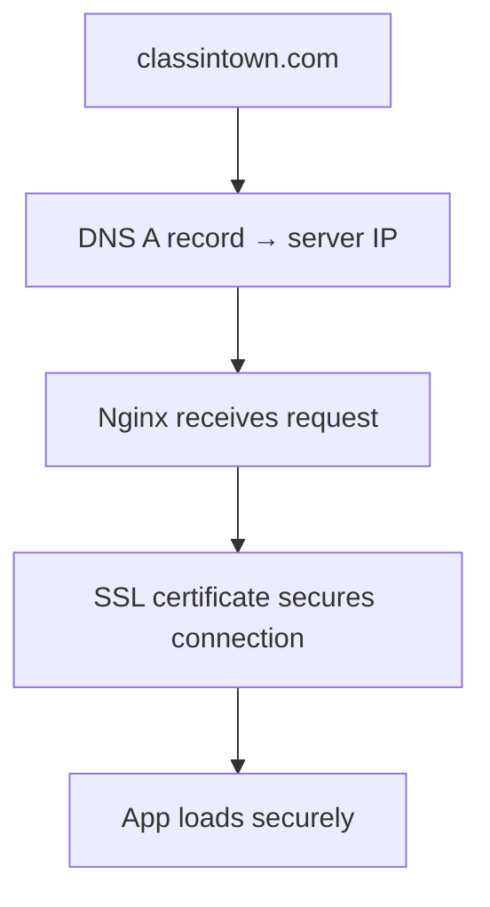

---

## 15. Environment Management

Every serious app has multiple environments.

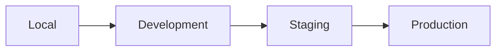

**Each environment has different:**

- Database URL, API URL
- Email, payment, Google, WhatsApp credentials
- Storage bucket

**Never hardcode secrets.** Use `.env`, environment variables, secret manager, config files.

---

## 16. Git and CI/CD

Manual deployment is fine in the beginning; later you need automation.

**Learn:** Git, branches, pull requests, GitHub Actions, CI/CD pipeline, build/test/deploy steps, rollback

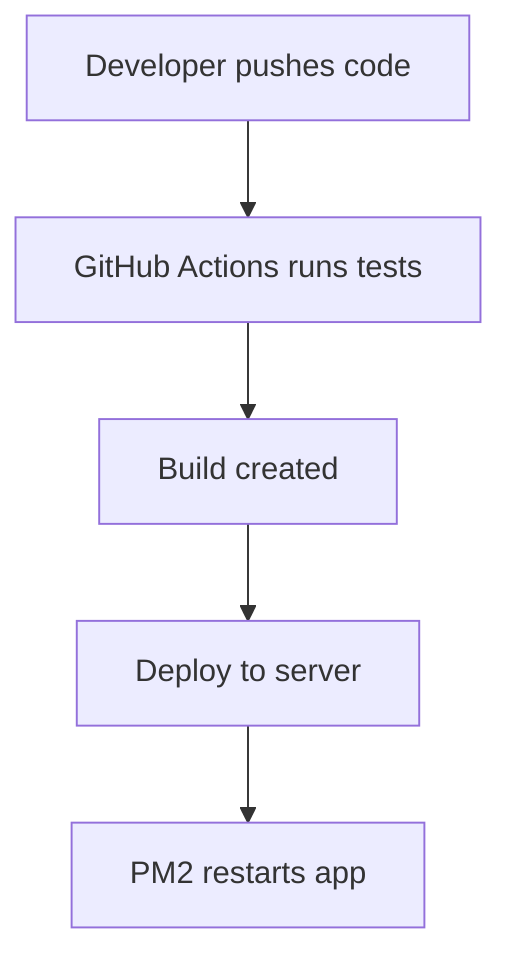

---

# Part III — Cloud & Operations

---

## 17. Docker

Docker helps package your application consistently.

**Learn:** image, container, Dockerfile, Docker Compose, volumes, networks, environment variables

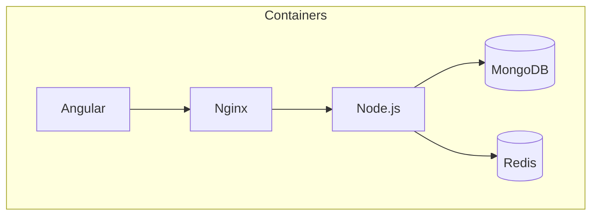

---

## 18. Cloud Infrastructure

**AWS services to start with:**

| AWS Service | Purpose |
|-------------|---------|
| EC2 | Virtual server |
| S3 | File storage |
| RDS | Managed SQL database |
| MongoDB Atlas / DocumentDB | MongoDB hosting |
| CloudFront | CDN |
| Route 53 | DNS |
| IAM | Permissions |
| VPC | Private network |
| Security Groups | Firewall rules |
| CloudWatch | Logs and monitoring |
| Lambda | Serverless functions |

**Common architecture for this type of application:**

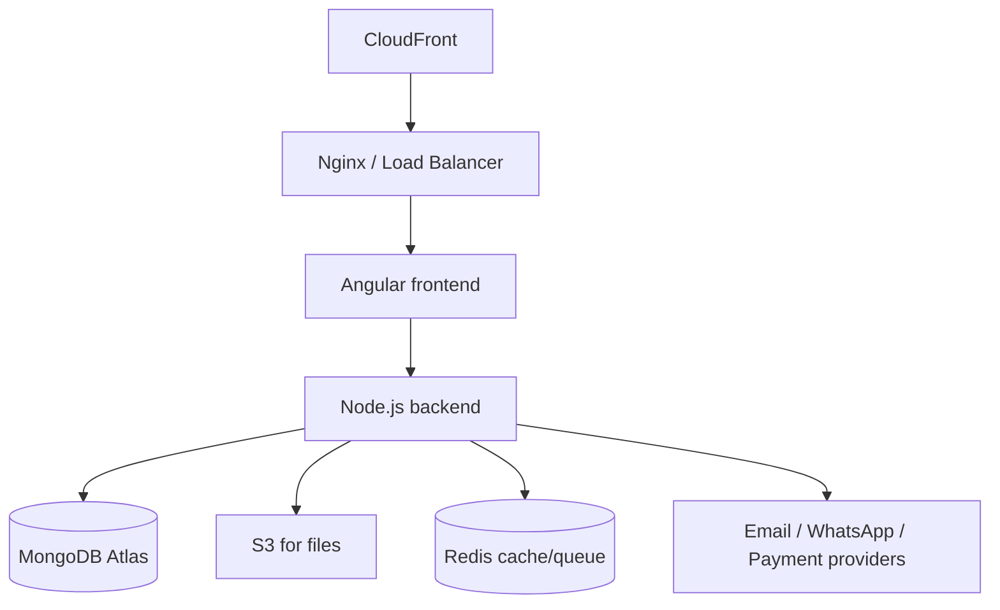

---

## 19. Security

Security must be learned throughout, not only at the end.

**Important topics:**

- HTTPS everywhere, password hashing, JWT expiry, refresh token rotation
- Input validation, rate limiting, CORS, Helmet
- SQL/NoSQL injection prevention, file upload validation
- RBAC, API authorization, secrets management
- Server firewall, database access restriction, audit logs

> **Basic rule:** Never trust frontend data. Always validate again in the backend.

---

## 20. Performance

Performance means making the app fast and stable.

| Layer | Techniques |
|-------|------------|
| **Frontend** | Lazy loading, code splitting, image compression, caching, CDN, minification, bundle size reduction |
| **Backend** | Database indexes, pagination, caching, avoid heavy sync work, queue background jobs, optimize API responses |
| **Database** | Indexes, aggregation optimization, query analysis, avoid unbounded queries, pagination, archiving old data |

---

## 21. Caching

Caching reduces load.

**Learn:** browser cache, CDN cache, Redis cache, API response cache, database query cache

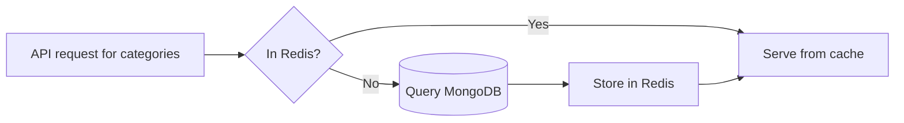

---

## 22. Background Jobs and Queues

Not every task should happen during the user request.

```mermaid
sequenceDiagram
    actor User
    participant API
    participant Queue
    participant Worker

    User->>API: Enroll in class
    API->>Queue: Enqueue notification job
    API-->>User: 200 OK (fast response)
    Queue->>Worker: Process job
    Worker->>Worker: Send email, WhatsApp, push
```

**Learn:** queue, worker, retry, failed jobs, delayed jobs, cron jobs, BullMQ, Redis

**Use cases:** send emails, generate reports, send reminders, process payment proof, sync calendar events, expire payment links

---

## 23. Monitoring and Logging

You must know what is happening in production.

**Learn:** application/error/access logs, PM2 logs, Nginx logs, database logs, uptime monitoring, alerting, performance monitoring

**Questions to answer:**

- Is the server up? Is the API slow?
- Which API is failing? Which user got an error?
- Why did payment fail? Was WhatsApp sent?
- Did the Google Calendar event get created?

**Tools:** CloudWatch, Sentry, Grafana, Prometheus, UptimeRobot, PM2 logs, Nginx logs, MongoDB Atlas monitoring

---

## 24. Backup and Disaster Recovery

This is production-grade knowledge.

**Learn:** database backup, file backup, point-in-time recovery, restore testing, server snapshot, multi-region backup, disaster recovery plan

> **Important rule:** Backup is useless unless restore is tested.

**You should know:**

- How often is the database backed up? Where is it stored?
- Who can access the backup?
- How quickly can the app be restored?
- What happens if the server crashes?

---

# Part IV — Scale & Production

---

## 25. Scaling

Scaling means handling more users.

```mermaid
flowchart TD
    subgraph Vertical["Vertical scaling"]
        V1[Bigger server]
        V2[More RAM / CPU]
    end

    subgraph Horizontal["Horizontal scaling"]
        H1[Multiple backend servers]
        H2[Load balancer distributes traffic]
    end
```

**Typical scaling path:**

```mermaid
flowchart TD
    S1[Single server] --> S2[Separate database]
    S2 --> S3[Add Redis]
    S3 --> S4[Move files to S3]
    S4 --> S5[Add load balancer]
    S5 --> S6[Multiple backend servers]
    S6 --> S7[CDN]
    S7 --> S8[Queue workers]
    S8 --> S9[Microservices only when needed]
```

> Do not start with microservices too early.

---

## 26. High Availability

High availability means the app should not go down easily.

**Learn:** load balancer, multiple servers, managed database, auto restart, health checks, failover, zero-downtime deployment, blue-green deployment, rolling deployment

```mermaid
flowchart LR
    LB[Load Balancer] --> S1[Server 1]
    LB --> S2[Server 2]
    LB --> S3[Server N]
    S1 & S2 & S3 --> HC[Health checks]
    HC -->|unhealthy| FO[Failover / remove instance]
```

---

## 27. Cost Management

Important for cloud infrastructure.

**Learn:** instance, storage, bandwidth, database, backup, logging, API provider costs; cloud bill alerts, budgets, auto-scaling limits

**For AWS, always set:**

- Billing alerts, budget alerts
- IAM restrictions, security groups, CloudWatch alarms

---

## 28. Production Architecture

**Final production-level architecture:**

```mermaid
flowchart TD
    U[Users] --> DNS[Domain / DNS]
    DNS --> CDN[Cloudflare / CDN]
    CDN --> LB[Load Balancer / Nginx]
    LB --> FE[Angular Frontend]
    FE --> BE[Node.js APIs]
    BE --> DB[(MongoDB Atlas)]
    BE --> R[(Redis Cache / Queue)]
    BE --> S3[S3 File Storage]
    BE --> EXT[Email / WhatsApp / Payment / Google Calendar]
    BE --> OBS[Monitoring / Logging / Backup]
```

---

# Learning Guide

---

## Best Learning Order

Follow this exact sequence:

| # | Topic |
|---|-------|
| 1 | What is a web application? |
| 2 | Frontend, backend, database |
| 3 | HTTP and APIs |
| 4 | Authentication and authorization |
| 5 | Database design |
| 6 | File uploads and storage |
| 7 | Notifications and integrations |
| 8 | Linux server basics |
| 9 | Deploy backend with PM2 |
| 10 | Deploy frontend with Nginx |
| 11 | Domain, DNS, SSL |
| 12 | Environment variables |
| 13 | Git and deployment flow |
| 14 | Docker basics |
| 15 | Cloud basics |
| 16 | Security |
| 17 | Performance |
| 18 | Caching |
| 19 | Queues and background jobs |
| 20 | Monitoring and logging |
| 21 | Backup and disaster recovery |
| 22 | Scaling |
| 23 | High availability |
| 24 | Cost control |
| 25 | Full production architecture |

---

## Final Mental Model

Whenever you think about infrastructure, think in this order:

```mermaid
flowchart TD
    Q1[How does the user reach the app?]
    Q2[How does the frontend load?]
    Q3[How does the frontend call the backend?]
    Q4[How does the backend process business logic?]
    Q5[Where is data stored?]
    Q6[Where are files stored?]
    Q7[How are notifications sent?]
    Q8[How is the app secured?]
    Q9[How is it deployed?]
    Q10[How is it monitored?]
    Q11[How is it backed up?]
    Q12[How will it scale?]
    Q13[What happens when something fails?]

    Q1 --> Q2 --> Q3 --> Q4 --> Q5 --> Q6 --> Q7 --> Q8 --> Q9 --> Q10 --> Q11 --> Q12 --> Q13
```

---

## Suggested Practical Learning Path

### Phase 1: Local Understanding

**Build and run locally:** Angular frontend + Node.js backend + MongoDB

**Goal:** Understand how frontend, backend, and database communicate.

```mermaid
flowchart LR
    A[Angular] <-->|HTTP| N[Node.js]
    N <-->|Driver| M[(MongoDB)]
```

---

### Phase 2: First Server Deployment

**Learn:** SSH, PM2, Nginx, domain, SSL, logs

**Goal:** Make the app accessible through a real domain.

```mermaid
flowchart LR
    DEV[Your machine] -->|git push| GH[GitHub]
    GH -->|deploy| SRV[Linux server]
    SRV --> DOM[classintown.com]
```

---

### Phase 3: Production Readiness

**Add:** environment variables, file storage, email/WhatsApp notifications, error handling, security middleware, backups, monitoring

**Goal:** Make the app safe, reliable, and maintainable.

---

### Phase 4: Scaling

**Add:** Redis, queues, CDN, S3, load balancer, multiple backend instances

**Goal:** Make the app ready for more users and traffic.

---

### Phase 5: Mature Infrastructure

**Add:** CI/CD, Docker, infrastructure as code, observability, disaster recovery, cost controls

**Goal:** Operate the application like a professional production system.

```mermaid
flowchart TB
    subgraph Mature["Mature production stack"]
        CICD[CI/CD pipeline]
        DOC[Docker containers]
        IAC[Infrastructure as code]
        OBS[Observability]
        DR[Disaster recovery]
        COST[Cost controls]
    end
    CICD --> DOC --> IAC
    IAC --> OBS --> DR --> COST
```
